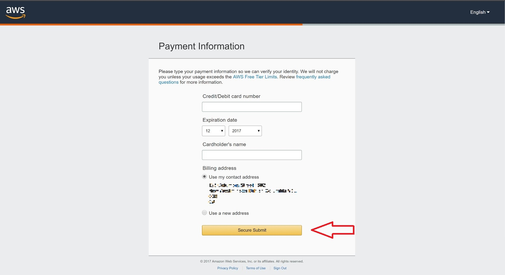

# Abstract

Reproducibility of data is crucial to science. Ease of reproducibility has numerous advantages and there are two very useful tools to aid with this. Galaxy is a workflow manager that ties together and manages the tools and scripts you use to process and analyse data. Docker is a powerful tool that you can use to encapsulate and isolate the runtime environments of your tools from the varied system environments they may face. With the ever growing scale of the datasets being processed, utilising large scale cloud computing is an economical option to generate results faster. Here we will discuss the various features of these tools and how to integrate them together on Amazon Cloud computing systems. We will also demonstrate how to integrate any tool or script that is not already available through Galaxy.

# Preamble

Reproducibility is a core tenet of science. If others are not able to reproduce your findings then it invalidates any conclusions you may have made. This holds true in computational biology where the transformation of raw data into something analysable can be difficult to reproduce. A wide variation in computing environments and runtime parameters needs to be documented or constrained to ensure that any of these factors can be reproduced when transforming the data. To add to the complexity of this task, biological data is relatively large and requires a significant amount of computing power to process the data in a reasonable amount of time. Luckily there are numerous services available that allow you to rent large clusters of computers and set them to your own tasks. The systems that make up these clusters can significantly vary and steps need to be taken to insulate your work from them. 
Utilising tools that make reproducibility easier does more than bolster the credibility of your work, it also makes it easier for others to utilise your work for their own purposes. The next person that want to use your work will also most likely be your future self. If after you have finalised publication and set the work aside forgetting about it, coming back to it later with a new purpose will be significantly easier if you take steps now to ensure ease of reproducibility. Even your current self will be rewarded by the extra effort taken. If erroneous results come up after a significant amount of time and effort was spent, then it will be much easier to iterate on the data while troubleshooting. 
If you have any experience in the data sciences then you will know the tribulations of trying to install and configure all the necessary tools to process data. This is especially true when trying to follow a publication’s vague description of how they generated their results. Wouldn’t it have been nice if the authors had published their entire computing environment? With all the software nicely compiled and all the configuration options already set up? This is entirely possible with a couple pieces of software that we will now discuss.

# Workflow Managers

Let's begin with the idea of a workflow. A workflow is a series of tools and dataset actions that run in sequence to transform data into a useful form. It usually involves data conversion, filtration, transformation, aggregation, segmentation, processing, and visualisation. They can include a mixture of custom scripts, 3rd party software, and manual curation. A workflow manager is a piece of software that keeps track of and executes each step. The two most critical pieces of information that a workflow manager should keep track of is the software version of the tools and the input parameters.
Here is a non-comprehensive list of workflow managers available from [wikipedia](https://en.wikipedia.org/wiki/Bioinformatics_workflow_management_system):
  * Galaxy: Web based graphical workflow manager
  * GenePattern: Web based workflow manager
  * BioBIKE: Web-based, programmable, integrated biological knowledge base.
  * Anduril: Workflow is described in a proprietary scripting language, AndurilScript.

When deciding on a workflow manager, there is a number of secondary qualities you should consider: ease of use, community support, extensibility, and extensive support for available tools. While BioBIKE may meet some specific use cases, it is not well suited for general tasks compared to the other options. Anduril has a steep learning curve and dependency on third party tools to get started. GenePattern and Galaxy are the two main contenders for general use. The defining quality that sets Galaxy apart from GenePattern is its graphical visualisation of the workflow. This makes it very easy and intuitive to get started with Galaxy with minimal training.

# Galaxy Workflow

This is the first thing you will see when accessing a Galaxy instance. From just this image you can see that it has features supporting multiple users. You can share data and workflows to collaborate with colleagues while keeping everything in one place. Galaxy has a large repository of tools already integrated and many more are available to be easily downloaded and installed from its online “Tool Shed”. On the right you can see it keeps record of everything you do so that you can manually experiment on your data rather than having to predefine a workflow.
Once you have determined the steps, you can formalise the process into a workflow. Galaxy makes this easy with an intuitive drag and drop interface.

This is a trivial example of a workflow that uses the T-Coffee multiple sequence aligner to align some input data. The input placeholder was added along with the T-Coffee tool by selecting them from the toolbar on the left. The output of the input placeholder was then simply dragged to the input of T-Coffee to create the mapping. These workflows can be as complex or as simple as needed with a varying number of tools.

The best way to learn is by doing, so let's get you started with your own Galaxy instance.

# Amazon Web Services

To sign up for AWS, first open the Amazon web services website here and click on “Complete Sign Up”.

Click on “Create a new AWS account”. If you already have an AWS account, skip to 11.

Enter your email address, password, and a AWS account name. Then, click on “Continue”.

A page will then show up to choose the account type you want to create. Select “Professional” if you want it for a company, an educational institution, or organisation, otherwise select “Personal”. Then, fill in your information and click on “Create Account and Continue”.

Now, enter your payment information and click on “Secure Submit”.

Then, verify your phone number by clicking on “Call Me Now”.

Wait for the call and enter the 4-digit code that is displayed and your identity should be verified.

Click on “Free” to select “Basic Plan”.

You can add more details to personalize your experience if you want to.

Now, to create an access key, first click on “Sign In to the Console”.

Sign in by using the account you just created.

Then, click on “My Security Credentials” under your account name.

Click on “Continue to Security Credentials”.

Click on “Users” in the left sidebar.

If there are no users, click on “Add user”. If there is a user, go to 20.

Fill in the information and click on “Next: Permissions”.

Click on “Next: Review”.

Click on “Create user”.

Click on “Close”.

Now, click on the user you just created.

Then, click on the “Security credentials” tab.

Click on “Create access key”.

Click on “Download .csv file” to save the access key ID and secret access key to a CSV file on your computer. Store the file in a secure location. You will not have access to the secret access key again after this dialog box closes. After you have downloaded the CSV file, choose “Close”.

In case you need more information about access keys, click [here](http://docs.aws.amazon.com/IAM/latest/UserGuide/id_credentials_access-keys.html).

