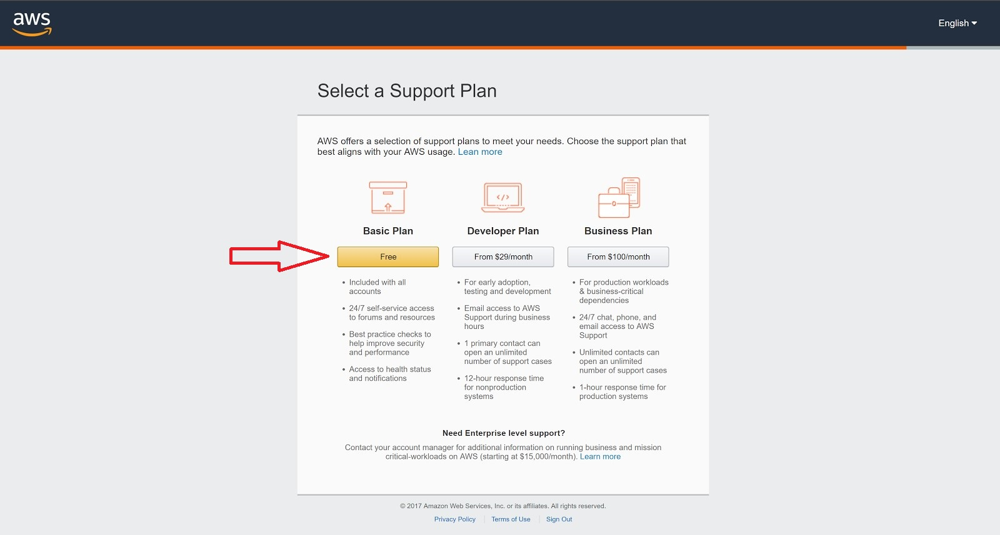
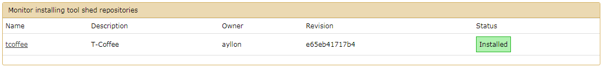
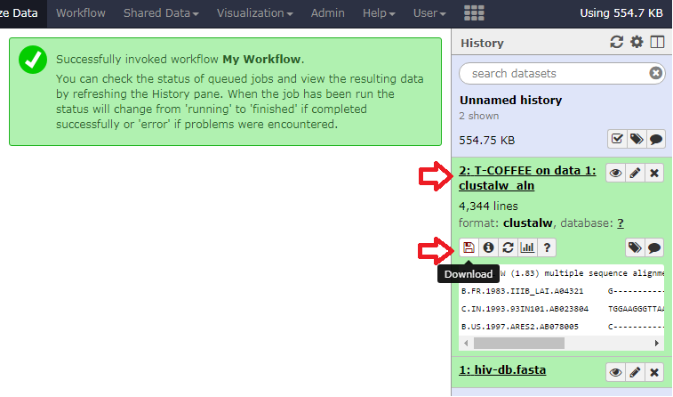

## Abstract

Reproducibility of data is crucial to science. Ease of reproducibility has numerous advantages and there are two very useful tools to aid with this. Galaxy is a workflow manager that ties together and manages the tools and scripts you use to process and analyse data. Docker is a powerful tool that you can use to encapsulate and isolate the runtime environments of your tools from the varied system environments they may face. With the ever growing scale of the datasets being processed, utilising large scale cloud computing is an economical option to generate results faster. Here we will discuss the various features of these tools and how to integrate them together on Amazon Cloud computing systems. We will also demonstrate how to integrate any tool or script that is not already available through Galaxy.

## Preamble

Reproducibility is a core tenet of science. If others are not able to reproduce your findings then it invalidates any conclusions you may have made. This holds true in computational biology where the transformation of raw data into something analysable can be difficult to reproduce. A wide variation in computing environments and runtime parameters needs to be documented or constrained to ensure that any of these factors can be reproduced when transforming the data. To add to the complexity of this task, biological data is relatively large and requires a significant amount of computing power to process the data in a reasonable amount of time. Luckily there are numerous services available that allow you to rent large clusters of computers and set them to your own tasks. The systems that make up these clusters can significantly vary and steps need to be taken to insulate your work from them. 
Utilising tools that make reproducibility easier does more than bolster the credibility of your work, it also makes it easier for others to utilise your work for their own purposes. The next person that want to use your work will also most likely be your future self. If after you have finalised publication and set the work aside forgetting about it, coming back to it later with a new purpose will be significantly easier if you take steps now to ensure ease of reproducibility. Even your current self will be rewarded by the extra effort taken. If erroneous results come up after a significant amount of time and effort was spent, then it will be much easier to iterate on the data while troubleshooting. 
If you have any experience in the data sciences then you will know the tribulations of trying to install and configure all the necessary tools to process data. This is especially true when trying to follow a publication’s vague description of how they generated their results. Wouldn’t it have been nice if the authors had published their entire computing environment? With all the software nicely compiled and all the configuration options already set up? This is entirely possible with a couple pieces of software that we will now discuss.

## Workflow Managers

Let's begin with the idea of a workflow. A workflow is a series of tools and dataset actions that run in sequence to transform data into a useful form. It usually involves data conversion, filtration, transformation, aggregation, segmentation, processing, and visualisation. They can include a mixture of custom scripts, 3rd party software, and manual curation. A workflow manager is a piece of software that keeps track of and executes each step. The two most critical pieces of information that a workflow manager should keep track of is the software version of the tools and the input parameters.
Here is a non-comprehensive list of workflow managers available from [wikipedia](https://en.wikipedia.org/wiki/Bioinformatics_workflow_management_system):
  * Galaxy: Web based graphical workflow manager
  * GenePattern: Web based workflow manager
  * BioBIKE: Web-based, programmable, integrated biological knowledge base.
  * Anduril: Workflow is described in a proprietary scripting language, AndurilScript.

When deciding on a workflow manager, there is a number of secondary qualities you should consider: ease of use, community support, extensibility, and extensive support for available tools. While BioBIKE may meet some specific use cases, it is not well suited for general tasks compared to the other options. Anduril has a steep learning curve and dependency on third party tools to get started. GenePattern and Galaxy are the two main contenders for general use. The defining quality that sets Galaxy apart from GenePattern is its graphical visualisation of the workflow. This makes it very easy and intuitive to get started with Galaxy with minimal training.

## Galaxy Workflow

<a href="images/welcometogalaxy.png"></a>
This is the first thing you will see when accessing a Galaxy instance. From just this image you can see that it has features supporting multiple users. You can share data and workflows to collaborate with colleagues while keeping everything in one place. Galaxy has a large repository of tools already integrated and many more are available to be easily downloaded and installed from its online “Tool Shed”. On the right you can see it keeps record of everything you do so that you can manually experiment on your data rather than having to predefine a workflow.
Once you have determined the steps, you can formalise the process into a workflow. Galaxy makes this easy with an intuitive drag and drop interface.

<a href="images/HIV_workflow.png"></a>
This is a trivial example of a workflow that uses the T-Coffee multiple sequence aligner to align some input data. The input placeholder was added along with the T-Coffee tool by selecting them from the toolbar on the left. The output of the input placeholder was then simply dragged to the input of T-Coffee to create the mapping. These workflows can be as complex or as simple as needed with a varying number of tools.

The best way to learn is by doing, so let's get you started with your own Galaxy instance.


## Amazon Web Services

<a href="images/AWS/AWS1.jpg"></a>
To sign up for AWS, first open the Amazon web services website [here](https://aws.amazon.com/) and click on “Complete Sign Up”.

<a href="images/AWS/AWS2.jpg"></a>
Click on “Create a new AWS account”. If you already have an AWS account, skip to 11.

<a href="images/AWS/AWS3.jpg"></a>
Enter your email address, password, and a AWS account name. Then, click on “Continue”.

<a href="images/AWS/AWS4.jpg"></a>
A page will then show up to choose the account type you want to create. Select “Professional” if you want it for a company, an educational institution, or organisation, otherwise select “Personal”. Then, fill in your information and click on “Create Account and Continue”.

<a href="images/AWS/AWS5.jpg"></a>
Now, enter your payment information and click on “Secure Submit”.

<a href="images/AWS/AWS6.jpg"></a>
Then, verify your phone number by clicking on “Call Me Now”.

<a href="images/AWS/AWS7.jpg"></a>
Wait for the call and enter the 4-digit code that is displayed and your identity should be verified.

<a href="images/AWS/AWS8.jpg"></a>
Click on “Free” to select “Basic Plan”.

<a href="images/AWS/AWS9.jpg"></a>
You can add more details to personalize your experience if you want to.

<a href="images/AWS/AWS10.jpg"></a>
Now, to create an access key, first click on “Sign In to the Console”.

<a href="images/AWS/AWS11.jpg"></a>
Sign in by using the account you just created.

<a href="images/AWS/AWS12.jpg"></a>
Then, click on “My Security Credentials” under your account name.

<a href="images/AWS/AWS13.jpg"></a>
Click on “Continue to Security Credentials”.

<a href="images/AWS/AWS14.jpg"></a>
Click on “Users” in the left sidebar.

<a href="images/AWS/AWS15.jpg"></a>
If there are no users, click on “Add user”. If there is a user, go to 20.

<a href="images/AWS/AWS16.jpg"></a>
Fill in the information and click on “Next: Permissions”.

<a href="images/AWS/AWS17.jpg"></a>
Click on “Next: Review”.

<a href="images/AWS/AWS18.jpg"></a>
Click on “Create user”.

<a href="images/AWS/AWS19.jpg"></a>
Click on “Close”.

<a href="images/AWS/AWS20.jpg"></a>
Now, click on the user you just created.

<a href="images/AWS/AWS21.jpg"></a>
Then, click on the “Security credentials” tab.

<a href="images/AWS/AWS22.jpg"></a>
Click on “Create access key”.

<a href="images/AWS/AWS23.jpg"></a>
Click on “Download .csv file” to save the access key ID and secret access key to a CSV file on your computer. Store the file in a secure location. You will not have access to the secret access key again after this dialog box closes. After you have downloaded the CSV file, choose “Close”.

In case you need more information about access keys, click [here](http://docs.aws.amazon.com/IAM/latest/UserGuide/id_credentials_access-keys.html).

## Cloudman

Once you have an account with AWS and an access key ready, you can begin with launching an instance of Galaxy on their systems. One of Galaxy’s many features is the accompanying CloudMan project that removes all the guesswork of installing and configuring a complete instance. It is a relatively painless process, even for someone with zero experience with Galaxy or AWS.
To begin, open the cloudman launcher [here](https://beta.launch.usegalaxy.org/).

<a href="images/cloudman.png"></a>
CloudMan manages your past and running Galaxy instances and so it needs a means of identifying you. Click the “Login” menu option in the top right.

<a href="images/cloudman_login.png"></a>
It will identify you through an account you have with one of the listed services. Click the preferred service you would like to use.

<a href="images/cloudman_catalog.png"></a>
Once you have logged in, scroll down the catalog list and select the Galaxy CloudMan appliance.

<a href="images/cloudman_launch.png"></a>
This will prompt you for the access key you generated in the previous section. You will have to open the file with a text editor and copy out the access key ID and secret key as the format expected by the “Load credentials from file” option is not compatible with the file given to you by Amazon. For the purpose of this tutorial you should also have ‘Amazon US East 1 - N. Virginia’ selected. Some Amazon Clouds are not currently supported by CloudMan. Once you have entered the information, click the “Test and use these credentials” button. You also have the option to click the “Save to Profile“ button to save the credentials for future use. When ready click “Next”.

<a href="images/cloudman_launch2.png"></a>
The next prompt asks you the specifics of the computer you want to run your root node on.
One important gotcha that we ran into when producing this tutorial is that Galaxy requires a significant amount of RAM and disk space. 50Gb is a safe number to allocate leaving lots of room for uploading your data. It is also important that you select “m4.xlarge” for the hardware as the Galaxy installation process requires a large amount of RAM and will fail if not allocated enough. This means you can’t use the lower free tiers that AWS offers for your primary node. It is important that you remember the password you enter here as you will use it throughout this tutorial. Once you are ready, click “Next”.

<a href="images/cloudman_launched.png"></a>
This will access AWS and automatically install and configure Galaxy.
It is also important to take note of the IP address here as it will be used later in this tutorial. In the image it is ‘34.201.1.85’ but will be different for your instance. Once you have recorded the address, wait for the status to say ‘Running’ and click the link to open the CloudMan manager page for your running instance.

<a href="images/cloud_login.png"></a>
It will ask you to authenticate, use ‘ubuntu’ as the username and the password you specified when creating the instance.

<a href="images/cloudman_init.png"></a>
Take note of the two green circles on the “Service Status” line. You need to wait for both to be green before you can continue. Once they are green, close the message box at the top. This page allows you to manage the cluster that was configured for you by CloudMan. While not necessary for this tutorial, you can increase the number of worker nodes allocated or turn on auto scaling which will grow and shrink the cluster as needed. Be careful with that feature though as it could cause you to receive a very large bill from AWS if it allocated a large number of nodes for a job.

<a href="images/cloudman_admin.png"></a>
In order to download tools from the tool shed, you need to become an admin user of the galaxy instance.
To do so, click on the “Admin” section on the top right corner of the page and type your email address in the box highlighted. Once entered click the “Set admin users” button.
Once that is done, click on the CloudMan icon in the top left corner of the page to return to the main page. Wait again for the circles to be green on the “Service Status” line. When they are green, click the “Access Galaxy” button.

# Install a Galaxy tool from the ToolShed

<a href="images/galaxy_register.png"></a>
The first thing you need to do is register yourself using the email address you entered into the CloudMan admin page. Click “Login or Register” and fill out the form.

<a href="images/galaxy_toolshed.png"></a>
If everything went well and you used the same email as entered in the previous section then you should be provided with a “Admin” menu option on the top bar. Click on it, then click on “Search Tool Shed” under “Tools and Tool Shed” on the sidebar on the left. Select “Galaxy Main Tool Shed” in the options presented. If it prompts, select “Browse valid repositories”.

<a href="images/galaxy_toolshed_search.png"></a>
In the search box provided search for ‘coffee’. This will provide a list of matching tools from the main Galaxy tool repository. For this tutorial we will use the one owned by ‘ayllon’. Click the corresponding button and click “Preview and install”.

<a href="images/galaxy_tcoffee_install.png"></a>
Click the “Install to Galaxy” button at the top.

<a href="images/galaxy_tcoffee_install2.png"></a>
It gives you the option to specify the category that the tools is listed on the left toolbar when doing analysis or building a workflow. You can specify a new one or select an existing one. Select “Multiple Alignments” from the drop down box and click “Install”.

<a href="images/galaxy_tcoffee_installed.png"></a>
When the installation is complete you should see the green “Installed” status on the right.

<a href="images/galaxy_new_workflow.png"></a>
Next we will test the tool in a workflow. Click the Workflow option on the top toolbar and click the “Create new workflow” button that is shown. 

<a href="images/galaxy_name_workflow.png"></a>
Enter a descriptive name and possibly a longer description in the respective fields and click “Create”.

<a href="images/galaxy_inputdata.png"></a>
In the workflow editor, select the “Inputs” category on the left and add a “Input dataset” placeholder to the workflow.

<a href="images/galaxy_tcoffee_workflow.png"></a>
Then use the search box at the top of the toolbox to search for ‘coffee’, this will reduce the list to any matches. Add the T-Coffee aligner tool the same way you did the Input dataset placeholder. Now drag the small arrow to the right of ‘output’ on the Input dataset placeholder. This will create a line you can then drag to the input arrow on the left of ‘Source File’ for the T-Coffee placeholder.
Click the T-Coffee placeholder box so that the T-Coffee options appear on the right. Check ‘kalign_msa’ and ‘Yes’ under the clustalw_aln output option.
One kwirk about Galaxy is that many of its important menu functions are unlabelled icons just below the top menu bar. If you are looking for a menu option it is best to start looking there. If you hover your mouse over the gear icon at the top it should pop up with a description. Click the gear icon and select “Save”. Click the gear icon again and select “Close”.

<a href="images/galaxy_tcoffee_workflow_run.png"></a>
Now that you have your workflow setup you can test everything by running it. Your workflow is now listed under the “Workflow” menu option. Click the button for the workflow you created and select “Run”.

<a href="images/galaxy_get_data.png"></a>
Now is a good time to upload some test data. We have prepared a small dataset that will align well, you can download it [here](data/hiv-db.fasta). It is 20 HIV genomes taken from the [HIV Sequence Database hosted by Los Alamos National Laboratories](https://www.hiv.lanl.gov/).
Click “Upload File” under the “Get Data” category on the left.

<a href="images/upload_data.png"></a>
This will present you with a upload box that you can then drag the test data file into or click “Choose local file” to select the file. Once selected click “Start”, wait for the upload to finish and then click “Close”.

<a href="images/run_workflow.png"></a>
If the input dataset dropdown doesn’t automatically switch to the uploaded file then refresh the page.
Pay attention to the history on the right, it keeps track of everything you did and you can then later download it for your record. It also contains all the uploaded data and results from your analysis. With the correct data set selected in the “Input dataset” drop down click “Run workflow” at the top.

<a href="images/run_workflow_result.png"></a>
The workflow task will appear in the History on the right as a greyed out box. Wait until it turns green signifying that the computation is complete. You can then click on the task to expand its options, this provides a download icon that allows you to download the resulting alignment file. Back in the “Workflow” section you also have the option to download the workflow that you created so that you can send it to others and they can import it into their Galaxy instances.
The best way to familiarise yourself with Galaxy is to play with its many tools and functions. The developers put in significant effort to ensure that someone can’t do any harm to the system from Galaxy, so you don’t have to worry when experimenting with the various features.

## Runtime Environment Management

Great, we have demonstrated that Galaxy can help ensure reproducibility of a workflow, but that is only half of the problem. Many tools available are affected by external factors within the system. Environment variables, runtime libraries, system configuration, filesystems, and external utilities to name some. The version, presence and state of these factors need to be managed. There are three leading solutions that address this, each with successively greater isolation from the host system. Anaconda is the least isolating and operates within the host environment. It manages software versioning and environment variables. It has a built-in package manager that allows easy installation of a rich library of utilities and applications. It is often paired with the next two solutions. VirtualBox is on the other end of the isolation spectrum. It provides a fully virtualized machine environment that is completely independent of the host system. The virtual machine runs its own operating system and installations and configurations of software. Although this seems like the ideal you would want, it comes at the cost of significant resource overhead and is also cumbersome to share the VM images. A reasonable compromise is Docker. It utilises linux containers to provide a level of isolation from the host system. You can *almost* think of it as a lightweight virtual machine but it has some critical differences from one. Each Docker container is provided with its own file system, network interfaces, and isolates the running processes on the system. For a more detailed comparison between Docker and a virtual machine see [here](https://stackoverflow.com/questions/16047306/how-is-docker-different-from-a-normal-virtual-machine).
Docker is also very useful because it makes sharing images easier as they are significantly more lightweight.

## Change a Galaxy tool to use Docker

Let's look at adapting an existing tool in Galaxy to be packaged inside a Docker instance. We will run T-Coffee from Galaxy within a Docker container. Rather than going through the trouble of creating your own docker image, you should have a look on DockerHub for an existing image. It is very likely that someone else has already gone through the trouble. If you find that you need to build a custom Docker image then [here](https://deis.com/blog/2015/creating-sharing-first-docker-image/) is a quick runthrough of how. 
To begin, open [DockerHub](https://hub.docker.com/) in a browser.

<a href="images/dockerhub.png"></a>
Search for ‘tcoffee’ with the search box at the top.

<a href="images/dockerhub_tcoffee.png"></a>
A list of results will be returned, we chose to use “cbcrg/tcoffee” for this tutorial. You only need the image name but you can click on the option for details.

Next you now need to connect to the Galaxy instance you previously created using SSH. For Windows you can use a SSH client like [PUTTY](http://www.putty.org/) or on linux and mac you can type ‘ssh ubuntu@[ip address of server]’ in the console. Replace ‘[ip address of server]’ with the IP address recorded in the previous section. It will prompt for a username and password, use the username ‘ubuntu’ and the password you specified when launching the instance.

There are 4 key files for this section:
* tcoffee.xml - an xml file that describes tcoffee to galaxy
* tcoffee.pl - a script that reformats the different options selected in galaxy tool GUI to be compatable with the T-Coffee executable
* job_conf.xml - an xml file that specifies how galaxy runs tools
* tool_conf.xml	- an xml file that organizes the “Tools” section of the galaxy GUI (not including tools that installed from the tool shed)

Since you have installed T-Coffee from the tool shed, you can obtain the first two files with:
```bash
$ sudo cp -r /mnt/galaxy/shed_tools/toolshed.g2.bx.psu.edu/repos/ayllon/tcoffee/e65eb41717b4/tcoffee ~/galaxy-app/tools/
```

The folder “tcoffee” contains tcoffee.xml and tcoffee.pl and the command will copy it to ~/galaxy-app/tools/, which is the directory Galaxy stores tools that are not from the ToolShed.

Modify the tool xml file by entering the following into the command prompt:
```bash
$ sudo nano ~/galaxy-app/tools/tcoffee/tcoffee.xml
```

Modify the “requirements” section of tcoffee.xml to tell Galaxy to run the docker image of T-Coffee:

Original:
```xml
<requirements>
	<requirement type="package" version=”10.00.r1613”>T-COFFEE</requirement>
</requirements>
```
Modified:
```xml
<requirements>
	<container type="docker">cbcrg/tcoffee</container>
</requirements>
```
To save this change press Ctrl-x then ‘y’ then enter.

Modify the tool_conf.xml by entering the following into the command prompt:
```bash
$ sudo nano ~/galaxy-app/config/job_conf.xml
```
Add the 3 lines below to job_conf.xml:
```xml
<destination id="docker_slurm" runner="slurm">
    <param id="docker_enabled">true</param>
</destination>
```

These three lines enable Docker as a destination and set slurm as a runner.
Slurm is a job scheduler that distributes the work over the cluster.

Original job_conf.xml:
```xml
<destinations default="slurm_cluster">
    <destination id="slurm_cluster" runner="slurm"/>
    <destination id="slurm_cluster_cpu4" runner="slurm">
	<param id="nativeSpecification">--nodes=1 --ntasks=4</param>
    </destination>
    <destination id="pulsar_server" runner="pulsar_rest">
	<param id="url">http://pulsar_server_ip:pulsar_server_port/</param>
    </destination>
    <destination id="local_runner" runner="local"/>
</destinations>
```

Modified job_conf.xml:
```xml
<destinations default="slurm_cluster">
    <destination id="slurm_cluster" runner="slurm"/>
    <destination id="slurm_cluster_cpu4" runner="slurm">
	<param id="nativeSpecification">--nodes=1 --ntasks=4</param>
    </destination>
    <destination id="pulsar_server" runner="pulsar_rest">
	<param id="url">http://pulsar_server_ip:pulsar_server_port/</param>
    </destination>
    <destination id="local_runner" runner="local"/>
    <destination id="docker_slurm" runner="slurm">
	<param id="docker_enabled">true</param>
    </destination>
</destinations>
```

To save this change press Ctrl-x then ‘y’ then enter.

Modify the tool_conf.xml by entering the following into the command prompt:
```bash
$ sudo nano ~/galaxy-app/config/tool_conf.xml
```

Add the 3 lines below to tool_conf.xml, simply add it at the end of the page before ‘</toolbox>’:
```xml
<section id="docker" name="Docker tools">
	<tool file="tcoffee/tcoffee.xml" />
</section>
```

These lines adds a section called “Docker tools” in the tool section of the galaxy GUI. It also tells galaxy the location of the tool xml.

Original tool_conf.xml:
```xml
<section id="plots" name="Graph/Display Data">
       <tool file="plotting/bar_chart.xml" />
       <tool file="plotting/boxplot.xml" />
	<tool file="maf/vcf_to_maf_customtrack.xml" />
</section>
```
Modified tool_conf.xml:
```xml
<section id="plots" name="Graph/Display Data">
	<tool file="plotting/bar_chart.xml" />
	<tool file="plotting/boxplot.xml" />
	<tool file="maf/vcf_to_maf_customtrack.xml" />
</section>
<section id="docker" name="Docker tools">
	<tool file="tcoffee/tcoffee.xml" />
</section>
```

To save this change press Ctrl-x then ‘y’ then enter.

No changes are needed for tcoffee.pl.

Now, just refresh the galaxy webpage and there should be a new section “Docker tools” in the tool box.
There you go, you can now run T-Coffee inside a Docker instance with Galaxy.

## Add a custom script as a tool in Galaxy
Modifying existing tools was a good introduction to the inner workings of how Galaxy tools work but it is more likely that you will want to wrap your own custom script or program and have Galaxy run it in a Docker image. Let's now take a simple Python script and pair it with an existing Docker image with the Python interpreter prepackaged.

The tool wrapper is written in XML following the [Galaxy tool schema](https://docs.galaxyproject.org/en/master/dev/schema.html). We need to make sure our own defined tools meet the requirements of the tool schema, otherwise during the validating step the errors will be identified and further modifications will be needed.

We will create a python script that takes a number and appends it after "Hello world!" then prints them with an option to print the author name or not. A -v command line argument to output a version number is also needed. A galaxy tool wrapper xml file needs to be created to support it, and this corresponding xml file needs to be validated before submitting.

We need to use the planemo tool validator to make sure the tool works and the wrapper needs to support the parallelisation options.

### Planemo
We use Planemo for both tool development (see tutorial) and publishing to the Tool Shed. Planemo is a command-line utilities to assist in building and publishing Galaxy tools. Planemo documentation is available [here](https://planemo.readthedocs.io/), and the source codes are available on [github](https://github.com/galaxyproject/planemo).

For a traditional Python installation of Planemo, first set up a virtualenv for Planemo (this example creates a new one in .vene) and then install with pip (Planemo requires pip 7.0 or newer). We can install Planemo using the following commands:
```bash
$ virtualenv .venv; . .venv/bin/activate
$ pip install "pip>=7" 		# Upgrade pip if needed.
$ pip install planemo
```
Another approach for installing Planemo is to use Homebrew or linuxbrew (this is what we use). To install Planemo this way use the brew command as follows.
```bash
$ brew tap galaxyproject/tap
$ brew install planemo
```
Noted Planemo is a set of utilities for developing Galaxy tools, each utility is implemented as a subcommand of the planemo executable. The [command documentation](http://planemo.readthedocs.io/en/latest/commands.html) describes these commands. We will use some of them in the following sections when developing, validating and submitting our own defined tool.

### Validate that the tool meets ToolShed standards with Planemo
We have a “helloW.py” python script which needs to be wrapped into an xml file. 
```python
import optparse, sys

def __main__():
    if '-v' in sys.argv:
        print("0.1.0")
    else:
        #Parse Command Line
        parser = optparse.OptionParser()
        (options, args) = parser.parse_args()
    
        assert len( args ) == 3, "Invalid command line specified."
    
        out_file = open( args[0], 'wb' )
        writer = out_file.write
        appendNum = args[1]
        author = args[2]

        writer("Hello World!")
        writer(appendNum)
        writer(author)
        print appendNum
        print author
        out_file.close()

if __name__=="__main__": __main__()
```


Noted we know that a Galaxy tool file is just an XML file, so now we could simply open an XML file editor and start writing the tool. Since we installed the Planemo, which has commands to quickly generate some of the boilerplate XML, so let’s start by doing that using the following command:
```bash
$ planemo tool_init --id 'helloW' --name 'Print Hello World'
```

The tool_init command can take various complex arguments, but the two most basic ones shown above are --id and --name. Every Galaxy tool needs an id (this is a short identifier used by Galaxy itself to identify the tool) and a name (this is displayed to the Galaxy user and should be a short description of the tool). A tool’s name can have whitespace but its id must not. After running this command, the created tool file will have the common sections required for a Galaxy tool but we will still need to open up the editor and fill out the command template, describe input parameters, tool outputs, write a help section, etc.

The command line will create the file helloW.xml, whose contents are like the following:

```xml
<tool id="helloW" name="Print Hello World" version="0.1.0">
    <requirements>
    </requirements>
    <stdio>
        <exit_code range="1:" />
    </stdio>
    <command><! [CDATA[
	TODO: Fill in command template
    ]]></command>
    <inputs>
    </inputs>
    <outputs>
    </outputs>
    <help><![CDATA[
	TODO: Fill in help.
    ]]></help>
</tool>
```

The tool_init command have a few other options except the --id and --name. We can define the example command with the --example_command option and the example input (output) with the --example_input (--example_output) option.These options can generate a command block by specifying the inputs and the outputs as follows. As we mentioned above, since we have created the tool xml file, we can just edit it instead of using the commands. 

We will generate the xml file, after which has correct definitions for the input and output as well as an actual command template. We can add the description section as a brief introduction of our tool and fill the help section with any additional information we’d like the tool users to view. After the above generations, the xml file will like the following.

```xml
<tool id="helloW" name="Print Hello World" version="0.1.0">
    <requirements>
    </requirements>
    <stdio>
        <exit_code range="1:" />
    </stdio>
    <description>and append the input number</description>
    <command>python $__tool_directory__/helloW.py $out_file $appendNum $author
        <version_command>python $__tool_directory__/helloW.py -v</version_command>
    </command>
    <inputs>
        <param name="appendNum" size="50" type="integer" value="123" label="appending number"/>
        <param name="author" type="select" display="radio" label="output author">
            <option value="invisible author">No</option>
            <option value="jianwei">Yes</option>
        </param>
    </inputs>
    <outputs>
        <data format="txt" name="out_file"/>
    </outputs>
    <help><![CDATA[
        This tool reads the user input number and append it behand "hello world!" then print.
        The user also have the option to display the author name of this tool.
        The -v option can be used to get the version of this tool.
    ]]></help>
</tool>
```

In the command block, we define two commands. The special value $__tool_directory__ here refers to the directory our tool lives in. Once we finish the galaxy tool, we can use our specified Galaxy instance or just simply using the Galaxy commands to call these two commands, which will have the equivalent output as when we use the python commands $ python helloW.py output 666 jianwei and $ python helloW.py -v, but the Galaxy didn’t directly access to the script, it calls the corresponding functions via the xml tool file with Galaxy commands.

The test section is important when our tool is complicated, as for the hello world example, we could just simply define the following test case. Noted the test case data should be stored in the test_data folder in the same directory of the xml file. This test case just input the parameter appendNum=123 and author=jianwei, and compare the output file with out_file.txt, which is the correct output file.

```xml
<tests>
	<test>
	    <param name="appendNum" value="123"/>
	    <param name="author" value="jianwei"/>
	    <output name="out_file" file="out_file.txt"/>
	</test>
</tests>
```

The test section is trivial in the hello world example, but we should pay much attention to this section when developing a complicated tool such as t-coffee, since before the tool is submitted into tool shed, we need to guarantee it works.

At this point we have a fairly functional Galaxy tool with test and help. This is a pretty simple example, usually we will need to put more work into the tool to get to this point - tool_init is really just designed to get us started. Now let’s lint and test the tool we have developed. The Planemo’s lint (or just l) command will review tool for XML validity and obvious mistakes. So far, our tool folder should include helloW.py, helloW.xml and the test data.

Now we run the lint and test commands:
```bash
$ planemo lint or $ planemo l
$ planemo test or $ planemo t
```
By default the lint and test commands will find all the tools in our current working directory, but we could have specified a particular tool with:
```bash
$ planemo lint helloW.xml
$ planemo test helloW.xml
```

Noted in the current working directory, there’s only one tool (helloW.xml), so the two set of commands are equivalent. If we did everything correctly and the tool xml file complies with the Galaxy tool schema, the lint will throw no errors, and all the tests will be passed. 

This tutorial is aiming to the basic user defined tool construction, so we just show the essential parts and options. There are much more parameter operations that can be defined to specify the command block and parameter block, such as conditional parameters, we can use the optional parameters and inputs to form different commands with one command block. In our hello world case, we only need to write a tool for a single relatively simple application or script, if we want to maintain a collection of related tools, experience suggests we will realize there is a lot of duplicated XML to do this well. Galaxy tool [XML macros](https://wiki.galaxyproject.org/Admin/Tools/ToolConfigSyntax#Reusing_Repeated_Configuration_Elements) can help reduce this duplication. For more additional unmentioned operations or technologies, you can see the [Planemo Documentation](https://planemo.readthedocs.io/).

Up to now, we build a tool for the hello world script and place the script in the same directory as the tool XML file itself. Now we can open Galaxy with the serve command (or just s).
```bash
$ planemo serve
...
serving on http://127.0.0.1:9090

Open up http://127.0.0.1:9090 in a web browser to view our new tool. Serve and test can be passed various command line arguments such as --galaxy_root to specify a Galaxy instance to use.
```

## Submit the tool to the ToolShed
We have wrapped the origin functional python script into a Galaxy xml tool file, now we should submit it to the toolshed, from where the other users can access to it. The Galaxy Tool Shed can store Galaxy tools, dependency definitions, and workflows among other Galaxy artifacts.

There are mainly three steps to submitting our hello world galaxy tool into the tool shed - configuring a shed account, creating a repository and updating the repository.

First, we need to configure a shed account. Before getting started, we ought to have an account on the [Galaxy test Tool Sheds](https://testtoolshed.g2.bx.psu.edu/). Also, we need to initialize a global Planemo configuration file (~/.planemo.yml). This can be done with:
```bash
$ planemo config_init
```
This will populate a template ~/.planemo.yml file and provide locations to fill in shed credentials for the test Tool Sheds. For each shed, fill in either an API key or an email and password. Also specify the shed_username created when registering shed accounts. We can edit the .planemo.yml file in the root directory in our computer. For our case, the .planemo.yml should be edited as following. The email and password represent our shed account of Galaxy.

```yaml
## Planemo Global Configuration File.
## Everything in this file is completely optional - these values can all be
## configured via command line options for the corresponding commands.

## Specify a default galaxy_root for test and server commands here.
#galaxy_root: /Users/eric/galaxy
## Username used with toolshed(s).
#shed_username: "jianwei"
sheds:
  # For each tool shed you wish to target, uncomment key or both email and
  # password.
  toolshed:
    #key: "<TODO>"
    #email: "jianweil@sfu.ca"
    #password: "123456789"
  testtoolshed:
    #key: "<TODO>"
    #email: "jianweil@sfu.ca"
    #password: "123456789"
  local:
    #key: "<TODO>"
    #email: "jianweil@sfu.ca"
    #password: "123456789"
```

<a href="images/repository1.png"></a>

<a href="images/repository2.png"></a>

<a href="images/helloworldtool.png"></a>


## Future Research

The goal of all of this is to have a means of perfectly replicating resulting data. Despite the use of Galaxy and Docker, there is still one variable that has not been accounted for. Software that uses floating point math or is compiled to use extended architectural functionality may generate different results on different systems depending on the specifics of that architecture. No matter the level of isolation attained at the software level, it all has to hand off the operations to the hardware to actually compute. Any minor inconsistencies between hardware revisions or manufacturer could result in different data output. More research needs to be done to guarantee consistency of low level architectural operations.

## Conclusion

Now that you know how to better manage your workflows with some very powerful tools you may want to see what you have actually accomplished.
We reproduced this tutorial on several different systems, retrieving the T-Coffee alignment output from each one. Here is a comparison of each of them:

T-Coffee ran with same data on 4 different systems without Docker:
```bash
$ diff -s --from-file=cloud_original.clustalw jianwei_original.clustalw rudy_original.clustalw jun_original.clustalw
```
```
Files cloud_original.clustalw and jianwei_original.clustalw are identical
Files cloud_original.clustalw and rudy_original.clustalw are identical
Files cloud_original.clustalw and jun_original.clustalw are identical
```

T-Coffee ran with the same data on 2 systems with Docker:
```bash
$ diff -s --from-file cloud_original.clustalw cloud_docker.clustalw jun_docker.clustalw
```
```
Files cloud_original.clustalw and cloud_docker.clustalw are identical
Files cloud_original.clustalw and jun_docker.clustalw are identical
```

The first thing you will notice is that T-Coffee did not need Docker as it was not sensitive to the runtime environment. This does not mean that you should not bother with Docker as it could save you from any surprises in the future if the workflow were to be rerun in a environment that causes it to fail. The other thing to take away from this comparison is that T-Coffee has numerous parameters and having everyone use all of the exact same ones would have been much more difficult without the shared workflow between the instances. T-Coffee was found to have a quirk when running it manually, if you pass the default output format explicitly then it changes the header in the output to a different layout. This is likely caused by incorrect documentation of what the default actually was but represents how easy it is to produce a different output even if you described to someone the parameters you used.
Gold standard data reproducibility can be very difficult, there are many variables in a computer system and you should use tools to minimise these variables. Galaxy and Docker are highly effective in this regard but you should also be conscious of any additional steps you might need to take to ensure that others can reproduce your data easily.


## Author Contributions

Special thanks to:

* Nolan for project planning, preliminary research, working out how to setup and manage a Galaxy instance on AWS, sourcing test data, and the T-Coffee analysis.
* Jianwei for T-Coffee analysis, Planemo research and setup, ToolShed management, user created tool integration, validation and submitting to ToolShed.
* Rudy for research and T-Coffee analysis.
* Zhengjun for T-Coffee analysis and Docker setup

And everyone for documenting their respective components of this tutorial.

